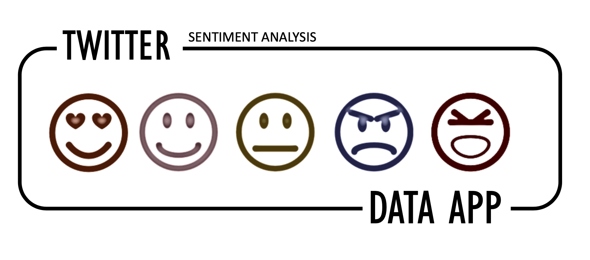

# :iphone: Sentimiento Móvil



---


## :loudspeaker: **Sentiment Analysis (NLP) of Mobile Operators** 

#### NLP with Huggingface: 

The model used to analyze the twitter mentions has been [bert-base-multilingual-uncased-sentiment](https://huggingface.co/nlptown/bert-base-multilingual-uncased-sentiment) that allows to have a classification of 1-5 stars.

This a bert-base-multilingual-uncased model finetuned for sentiment analysis on product reviews in six languages: English, Dutch, German, French, Spanish and Italian. It predicts the sentiment of the review as a number of stars (between 1 and 5).

This model is intended for direct use as a sentiment analysis model for product reviews in any of the six languages above, or for further finetuning on related sentiment analysis tasks.

## :chart_with_upwards_trend: **URL** 


### [Sentimiento Móvil](https://www.sentimienomovil.es/)  
#### https://www.sentimienomovil.es


## :floppy_disk: **Data:**

Every day I extract from twitter the mentions of the twelve mobile operators in Spain.

With this information I update a [Postgresql](https://www.postgresql.org/) database where all the mentions are stored.


#### Running the app locally

First create a virtual environment with conda or venv inside a temp folder, then activate it.

```
virtualenv venv
# Windows
venv\Scripts\activate
# Or Linux
source venv/bin/activate
```

Clone the git repo, then install the requirements with pip

```
git clone https://github.com/carpiero/Sentiment_Spanish_Operator.git
cd /Sentiment_Spanish_Operator
pip install -r requirements.txt
```

Run the app

```
python app.py
```

### Built With

- [Dash](https://dash.plot.ly/) - Main server and interactive components
- [Plotly Python](https://plot.ly/python/) - Used to create the interactive plots


## :art: **Screenshots**

The following are screenshots for the app in this repo:


## :computer: **Technology stack**

- Python==3.7.3
- Pandas==1.0.3
- Dash==1.13.4
- Numpy==1.18.1
- Plotly==4.8.2
- Gunicorn==20.0.4
- Pyarrow==0.17.1
- Spacy==2.3.2
- Transformers==3.3.1
- Tweepy==3.9.0


## :file_folder: **Folder structure**
```
└── Sentiment_Spanish_Operator
    ├── Img
    ├── Notebooks
    ├── assets
    │    ├── github.svg
    │    ├── readme.gif
    │    ├── resizin_scrpt.js
    │    ├── s1.css
    │    ├── styles.css
    │    └──twitter_logo.png
    ├── data
    │    ├── df.parquet
    │    └── df_total.parquet
    ├── wrangling
    │    ├── __init__.py
    │    └── word_cloud.py
    ├── .gitattributes
    ├── .gitignore
    ├── check_database.py
    ├── check_database_sent.py
    ├── app.py
    ├── controls.py
    ├── requeriments.txt
    ├── README.md
    ├── sentimientomovil.ini
    ├── streamlit_controls.py
    ├── streamlit_controls_day.py
    ├── twitter_database.py
    ├── twitter_database_sent.py
    └── wsgi.py
    
    
```
